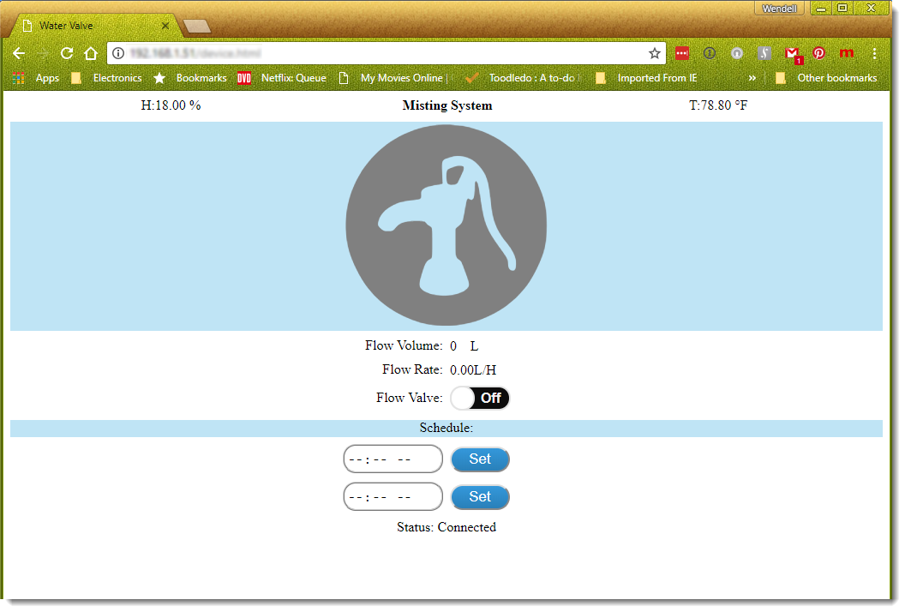

# ESP8266_Misting_Valve_Controller

ESP8266 web-socket controller for a Solenoid valve. This controller has the ability to create on and off schedule for a water flow valve for a misting system. Temperature and humidity sensors are also included.  

</img>

When the device.html page is requested (e.g.“http://192.168.1.100/device.html”) the ESP8266 web server is instructed to look in the memory variable PAGE_DeviceControlPage in DeviceControl.h for the html data. 

An alternative approach is to use SPIFFS to store a physical device.html file on the ESP8266. To accomplish this copy the <! Document html> content from the devicecontrol.h and past it into a new file and name it “Device.html”

[Brass Liquid Solenoid Valve - 12V - 1/2 NPS](https://www.adafruit.com/product/996) and 
[Hall Effect Flow Sensor](https://www.amazon.com/gp/product/B01FJR9RRK/ref=oh_aui_detailpage_o00_s00?ie=UTF8&psc=1)

D1 Mini, DH22 and PVC housing. The DH22 is isolated from the the D1 Mini is a PVC housing that allows air circulation but prevent water entering.
